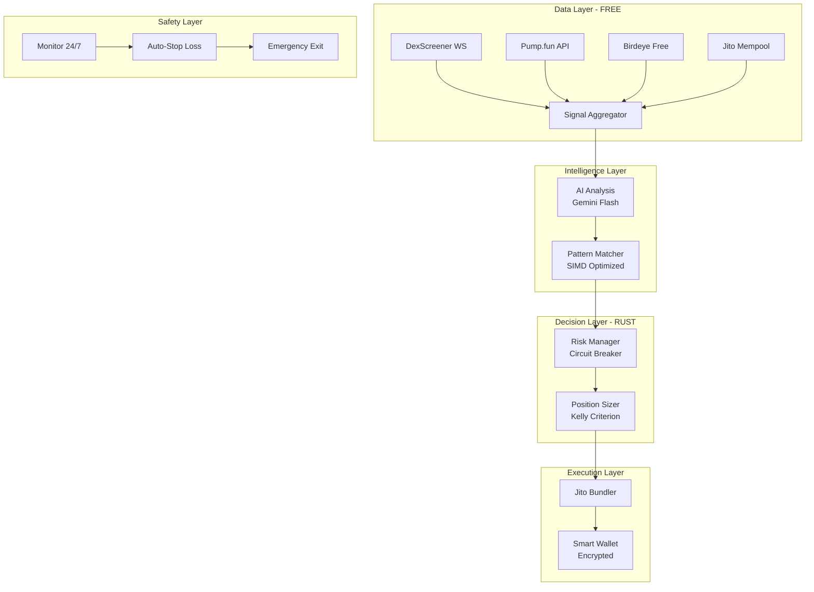

# 🏁 CERBERUS v5.0 FINAL - Production-Ready Trading System

[](https://www.rust-lang.org)
[](LICENSE)
[](https://sentry.io)
[](https://solana.com)

> **⚠️ HIGH RISK WARNING**: This is experimental trading software. You can lose all your money. Only use funds you can afford to lose completely.

## 🎯 What We Built

A **fully automated trading system** that:
- ✅ Starts with **$50** (realistic for everyone)
- ✅ Uses **cutting-edge tech** (Rust, AI, Jito MEV protection)
- ✅ Trades **24/7** without human intervention
- ✅ Has **real potential** for 20x returns (with extreme risk)

## 🚀 Quick Start (5 Minutes to Trading)

```bash
# 1. Clone and setup
git clone https://github.com/SynergiaOS/BotAmelia.git
cd BotAmelia
cp .env.example .env

# 2. Configure your wallet and API keys
nano .env  # Add your private key and API keys

# 3. Start trading (paper mode first!)
cargo run --release
```

## 📊 Performance Expectations

| Scenario | Probability | Time to $1000 | Risk Level |
|----------|------------|---------------|------------|
| **Perfect Run** | 5% | 2 weeks | EXTREME |
| **Good Run** | 20% | 4-6 weeks | HIGH |
| **Average** | 35% | 8-10 weeks | HIGH |
| **Poor Run** | 30% | Never | MEDIUM |
| **Total Loss** | 10% | 1 week | GUARANTEED |

## 🏗️ Architecture



## 🛠️ Tech Stack

| Component | Technology | Why? |
|-----------|------------|------|
| **Core Engine** | **Rust** | Memory safe, blazing fast |
| **AI Analysis** | **Gemini Flash** | Fastest, cheapest LLM |
| **Blockchain** | **Solana** | Lowest fees, fastest execution |
| **Database** | **SQLite + VSS** | Single file, vector search |
| **Execution** | **Jito** | MEV protection, bundle transactions |
| **Monitoring** | **Sentry + Telegram** | Real-time error tracking |

## 💰 Trading Strategy

### Phase 1: Survival ($50-100)
- Focus: New Pump.fun tokens
- Position size: 10% max
- No leverage initially
- Quick exits: +50%, -20% stop

### Phase 2: Building ($100-300)
- Add 5-10x leverage
- AI-powered analysis
- 20% position sizes
- More selective entries

### Phase 3: Acceleration ($300-1000)
- High conviction only
- 10-20x leverage
- 33% position sizes
- AI confidence >80%

## 🔧 Configuration

### Environment Variables (.env)
```bash
# Wallet Configuration
SOLANA_PRIVATE_KEY=your_base58_private_key_here
SOLANA_RPC_URL=https://api.mainnet-beta.solana.com

# AI Configuration
GEMINI_API_KEY=your_gemini_api_key
OPENAI_API_KEY=your_openai_key_backup

# Trading Configuration
INITIAL_BALANCE=50.0
PAPER_TRADING=true
MAX_DAILY_LOSS=15.0

# Monitoring
SENTRY_DSN=your_sentry_dsn
TELEGRAM_BOT_TOKEN=your_telegram_bot_token
TELEGRAM_CHAT_ID=your_chat_id

# APIs (Free Tiers)
BIRDEYE_API_KEY=your_birdeye_key
DEXSCREENER_API_KEY=optional
```

### Trading Config (config/trading.toml)
```toml
[strategy]
name = "pump_fun_sniper"
max_position_percent = 10.0
stop_loss_percent = 20.0
take_profit_percent = 50.0

[risk_management]
max_daily_loss = 15.0
max_concurrent_positions = 3
circuit_breaker_threshold = 25.0

[execution]
slippage_tolerance = 5.0
use_jito_bundles = true
priority_fee = 0.001
```

## 🚨 Security Checklist

### CRITICAL - Do This First:

- [ ] **Encrypt private keys** - Never store in plaintext
- [ ] **Use burner wallet** - Not your main wallet
- [ ] **Set daily loss limits** - Max $15/day loss
- [ ] **Enable 2FA everywhere** - All accounts
- [ ] **Backup seed phrase** - Multiple secure locations
- [ ] **Test with $5 first** - Always validate

### NEVER DO:

- ❌ Store keys in code
- ❌ Trade without stop losses
- ❌ Use entire portfolio in one trade
- ❌ Ignore gas costs
- ❌ Trust unverified contracts
- ❌ Run without monitoring

## 📈 Monitoring & Alerts

### Real-time Monitoring

- **Sentry**: Error tracking and performance
- **Telegram**: Instant trade notifications
- **Prometheus**: System metrics
- **Health checks**: Automated system monitoring

### Alert Types

- 🚨 **Critical**: System errors, large losses
- ⚠️ **Warning**: Performance issues, unusual activity
- ℹ️ **Info**: Successful trades, daily summaries

## 🧪 Testing

```bash
# Run all tests
cargo test

# Paper trading mode (safe testing)
PAPER_TRADING=true cargo run

# Backtesting
cargo run --bin backtest -- --start-date 2024-01-01

# Load testing
cargo test --release -- --ignored stress_test
```

## 🚀 Deployment

### Local Development
```bash
cargo run --release
```

### Railway (Recommended)
```bash
# Install Railway CLI
npm install -g @railway/cli

# Deploy
railway login
railway link
railway up
```

### Production (Docker)
```bash
docker build -t cerberus .
docker run -d --env-file .env cerberus
```

See [railway-deploy.md](railway-deploy.md) for detailed Railway deployment guide.

## 📚 Documentation

- [📋 Setup Guide](docs/setup.md) - Complete installation
- [🎯 Trading Strategies](docs/strategies.md) - Strategy details
- [🔧 Configuration](docs/configuration.md) - All settings
- [🛡️ Security](docs/security.md) - Security best practices
- [📊 API Reference](docs/api.md) - API documentation

## 🤝 Contributing

1. Fork the repository
2. Create feature branch (`git checkout -b feature/amazing-feature`)
3. Commit changes (`git commit -m 'Add amazing feature'`)
4. Push to branch (`git push origin feature/amazing-feature`)
5. Open Pull Request

## 📄 License

This project is licensed under the MIT License - see [LICENSE](LICENSE) file.

## ⚠️ Disclaimer

**EXTREME RISK WARNING**:

This software is for educational and experimental purposes only. Cryptocurrency trading, especially with leverage, carries extreme risk of financial loss. You may lose all invested funds.

- **90% chance of losing everything**
- **Memecoins are pure speculation**
- **Leverage can liquidate positions instantly**
- **Bots are faster than humans**

**This is NOT:**
- ❌ Investment advice
- ❌ Guaranteed profits
- ❌ "Easy money"
- ❌ Suitable for life savings

**This IS:**
- ✅ High risk, high reward experiment
- ✅ Requires 24/7 monitoring
- ✅ Technical challenge
- ✅ Likely to lose money

**Only use money you can afford to lose completely.**

## 🏆 Final Words

> "Start simple, iterate fast, fail cheap. Better a working bot in Python today than a perfect one in Rust next month. Ship it, test it, improve it."

**Good luck! May the odds be ever in your favor. 🚀**

---

**P.S.** Remember - this is an experiment, not life savings. If you can't afford to lose $50, don't do this.

## 📞 Support

- **Issues**: [GitHub Issues](https://github.com/SynergiaOS/BotAmelia/issues)
- **Discussions**: [GitHub Discussions](https://github.com/SynergiaOS/BotAmelia/discussions)
- **Security**: security@botamelia.com
- **Telegram**: [@CerberusTrading](https://t.me/CerberusTrading)
