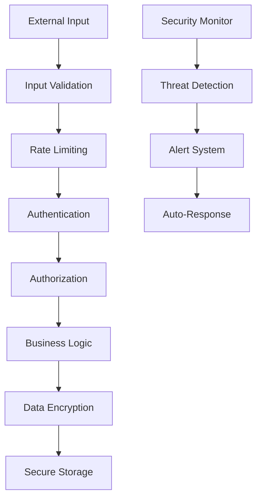

# Security Policy

## 🚨 Critical Security Warning

**EXTREME RISK SOFTWARE**: Cerberus is experimental trading software that handles real cryptocurrency funds. Security vulnerabilities can result in complete loss of funds.

**Use at your own risk. Only use funds you can afford to lose completely.**

## 🛡️ Security Measures

### Built-in Security Features

1. **Private Key Encryption**: All private keys are encrypted at rest
2. **Memory Protection**: Sensitive data is zeroized after use
3. **Input Validation**: All external inputs are validated and sanitized
4. **SQL Injection Prevention**: Parameterized queries only
5. **Rate Limiting**: API requests are rate-limited to prevent abuse
6. **Secure Random Generation**: Cryptographically secure randomness
7. **Constant-Time Comparisons**: Prevents timing attacks
8. **Error Sanitization**: No sensitive data in error messages

### Security Architecture



## 🔒 Supported Versions

We provide security updates for the following versions:

| Version | Supported          | End of Life |
| ------- | ------------------ | ----------- |
| 5.0.x   | ✅ Yes             | TBD         |
| 4.0.x   | ⚠️ Critical only   | 2025-06-01  |
| < 4.0   | ❌ No              | 2024-12-01  |

## 🚨 Reporting Security Vulnerabilities

**DO NOT** report security vulnerabilities through public GitHub issues.

### Responsible Disclosure Process

1. **Email**: security@botamelia.com
2. **Subject**: "SECURITY: [Brief Description]"
3. **Include**:
   - Detailed description of the vulnerability
   - Steps to reproduce
   - Potential impact assessment
   - Suggested fix (if any)
   - Your contact information

### What to Include

```
Subject: SECURITY: [Brief Description]

Vulnerability Details:
- Component affected: [e.g., wallet management, API endpoint]
- Vulnerability type: [e.g., injection, authentication bypass]
- Severity: [Critical/High/Medium/Low]

Reproduction Steps:
1. [Step 1]
2. [Step 2]
3. [Result]

Impact:
- Potential for fund loss: [Yes/No]
- Data exposure risk: [Yes/No]
- System compromise: [Yes/No]

Suggested Fix:
[Your recommendations]

Contact:
- Name: [Your name]
- Email: [Your email]
- PGP Key: [If available]
```

### Response Timeline

- **Acknowledgment**: Within 24 hours
- **Initial Assessment**: Within 72 hours
- **Status Update**: Weekly until resolved
- **Fix Development**: Depends on severity
- **Public Disclosure**: After fix is deployed

### Severity Classification

#### Critical (24-48 hour response)
- Direct fund loss possible
- Private key exposure
- Remote code execution
- Authentication bypass

#### High (72 hour response)
- Significant data exposure
- Privilege escalation
- Denial of service
- Trading manipulation

#### Medium (1 week response)
- Information disclosure
- Local privilege escalation
- Cross-site scripting

#### Low (2 week response)
- Minor information leaks
- Non-security bugs with security implications

## 🔐 Security Best Practices for Users

### Wallet Security

1. **Use Burner Wallets**: Never use your main wallet
2. **Limit Funds**: Only deposit what you can afford to lose
3. **Backup Seed Phrases**: Store securely offline
4. **Enable 2FA**: On all related accounts
5. **Regular Audits**: Check wallet activity regularly

### Environment Security

```bash
# Secure file permissions
chmod 600 .env
chmod 600 config/config.toml
chmod 700 data/

# Secure private key storage
export SOLANA_PRIVATE_KEY=$(cat encrypted_key.txt | decrypt)
```

### Network Security

1. **Use HTTPS**: Always use encrypted connections
2. **VPN Recommended**: For additional privacy
3. **Firewall Rules**: Restrict unnecessary ports
4. **Monitor Traffic**: Watch for unusual activity

### Operational Security

1. **Regular Updates**: Keep software updated
2. **Monitor Logs**: Watch for suspicious activity
3. **Backup Data**: Regular encrypted backups
4. **Incident Response**: Have a plan for breaches

## 🛠️ Security Configuration

### Recommended Security Settings

```toml
# config/security.toml
[security]
enable_monitoring = true
log_security_events = true
auto_lockdown = true
max_failed_attempts = 3

[encryption]
algorithm = "AES-256-GCM"
key_derivation = "PBKDF2"
iterations = 100000

[network]
use_tls = true
verify_certificates = true
timeout_seconds = 30

[authentication]
require_2fa = true
session_timeout = 3600
max_sessions = 1
```

### Environment Variables

```bash
# Security-related environment variables
CERBERUS_SECURITY_LEVEL=high
CERBERUS_ENABLE_AUDIT_LOG=true
CERBERUS_AUTO_LOCKDOWN=true
CERBERUS_MAX_DAILY_LOSS=50.0
```

## 🔍 Security Monitoring

### Automated Monitoring

Cerberus includes built-in security monitoring:

1. **Anomaly Detection**: Unusual trading patterns
2. **Access Monitoring**: Failed authentication attempts
3. **Network Monitoring**: Suspicious connections
4. **Performance Monitoring**: Potential DoS attacks
5. **Data Integrity**: Corruption detection

### Security Events

The system automatically monitors for:

```rust
pub enum SecurityEvent {
    UnauthorizedAccess,
    SuspiciousTransaction,
    TradingAnomaly,
    IntrusionAttempt,
    DataLeak,
    CryptographicError,
    IntegrityViolation,
}
```

### Alert Thresholds

```toml
[security.alerts]
failed_login_threshold = 5
unusual_volume_multiplier = 10.0
suspicious_transaction_amount = 1000.0
max_api_requests_per_minute = 100
```

## 🚨 Incident Response

### If You Suspect a Security Breach

1. **Immediate Actions**:
   ```bash
   # Stop the system immediately
   pkill -f cerberus
   
   # Secure your wallet
   # Move funds to a secure wallet
   
   # Preserve evidence
   cp logs/cerberus.log incident_$(date +%Y%m%d_%H%M%S).log
   ```

2. **Report the Incident**:
   - Email: security@botamelia.com
   - Include: Logs, timeline, suspected cause
   - Preserve: All evidence

3. **Recovery Steps**:
   - Change all passwords and API keys
   - Rotate private keys
   - Update all software
   - Review and update security settings

### Emergency Contacts

- **Security Team**: security@botamelia.com
- **Emergency Hotline**: Available in Telegram group
- **Community Support**: GitHub Discussions

## 🔒 Cryptographic Standards

### Encryption Algorithms

- **Symmetric**: AES-256-GCM
- **Asymmetric**: RSA-4096, Ed25519
- **Hashing**: SHA-256, BLAKE3
- **Key Derivation**: PBKDF2, Argon2id
- **Random Generation**: ChaCha20Rng

### Key Management

```rust
// Example secure key handling
use zeroize::Zeroize;

#[derive(Zeroize)]
struct SecretKey {
    key: [u8; 32],
}

impl Drop for SecretKey {
    fn drop(&mut self) {
        self.zeroize();
    }
}
```

## 📋 Security Checklist

### Pre-Deployment Security Audit

- [ ] All dependencies updated and audited
- [ ] Static analysis tools run (clippy, cargo-audit)
- [ ] Dynamic analysis completed
- [ ] Penetration testing performed
- [ ] Code review by security team
- [ ] Configuration hardening applied
- [ ] Monitoring and alerting configured
- [ ] Incident response plan tested

### Regular Security Maintenance

- [ ] Weekly dependency updates
- [ ] Monthly security scans
- [ ] Quarterly penetration testing
- [ ] Annual security audit
- [ ] Continuous monitoring review
- [ ] Regular backup testing
- [ ] Security training updates

## 🏆 Security Acknowledgments

We thank the following security researchers for their responsible disclosure:

- [Name] - [Vulnerability] - [Date]
- [Name] - [Vulnerability] - [Date]

### Bug Bounty Program

We offer rewards for security vulnerabilities:

- **Critical**: $1,000 - $5,000
- **High**: $500 - $1,000
- **Medium**: $100 - $500
- **Low**: $50 - $100

*Rewards are subject to vulnerability impact and quality of report.*

## 📞 Contact Information

- **Security Team**: security@botamelia.com
- **PGP Key**: [Available on request]
- **Response Time**: 24 hours for critical issues
- **Telegram**: [@CerberusTrading](https://t.me/CerberusTrading)

## 📄 Legal Notice

This security policy is subject to our Terms of Service and Privacy Policy. By using Cerberus, you acknowledge the inherent risks of cryptocurrency trading and agree to use the software at your own risk.

**Remember**: No software is 100% secure. Always use appropriate risk management and never invest more than you can afford to lose.
