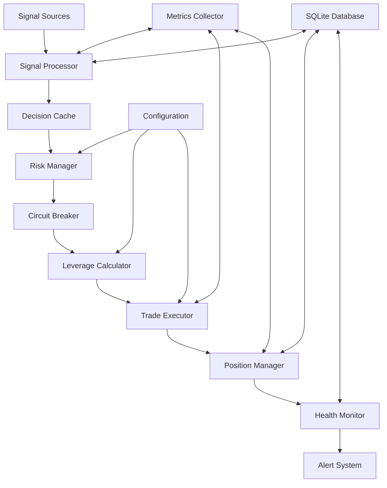

# Design Document

## Overview

Cerberus v4.0 is a high-performance, Rust-based leverage trading framework designed for aggressive memecoin trading with comprehensive risk management. The system follows a modular architecture with clear separation of concerns, enabling rapid decision-making while maintaining strict risk controls.

The framework is built around a central state manager that coordinates between signal processing, risk management, trade execution, and monitoring components. All components communicate through well-defined interfaces and share a common configuration system.

## Architecture



### Core Components

1. **Signal Processor**: Validates and normalizes incoming trading signals
2. **Decision Cache**: LRU cache for rapid decision retrieval
3. **Risk Manager**: Evaluates risk parameters and position sizing
4. **Circuit Breaker**: Emergency stop mechanism for loss protection
5. **Leverage Calculator**: Dynamic leverage optimization based on market conditions
6. **Trade Executor**: Handles order placement and execution
7. **Position Manager**: Tracks and manages open positions
8. **Health Monitor**: Continuous system health monitoring
9. **Alert System**: Real-time notifications via Telegram/Discord

## Components and Interfaces

### Signal Processing Layer

```rust
pub trait SignalSource {
    async fn get_signals(&self) -> Result<Vec<Signal>>;
    fn source_name(&self) -> &str;
    fn is_connected(&self) -> bool;
}

pub struct Signal {
    pub token: String,
    pub source: String,
    pub confidence: Confidence,
    pub price: f64,
    pub volume: f64,
    pub timestamp: i64,
    pub metadata: serde_json::Value,
}

pub enum Confidence {
    Low,      // 5x base leverage
    Medium,   // 10x base leverage  
    High,     // 20x base leverage
    Extreme,  // 30x base leverage
}
```

### Risk Management Interface

```rust
pub trait RiskManager {
    async fn evaluate_risk(&self, signal: &Signal, portfolio: &Portfolio) -> RiskAssessment;
    async fn check_position_limits(&self, new_position: &Position) -> bool;
    async fn calculate_position_size(&self, signal: &Signal, leverage: u8) -> f64;
}

pub struct RiskAssessment {
    pub approved: bool,
    pub max_leverage: u8,
    pub position_size: f64,
    pub reasoning: String,
}
```

### Trade Execution Interface

```rust
pub trait TradeExecutor {
    async fn execute_trade(&self, order: &TradeOrder) -> Result<ExecutionResult>;
    async fn close_position(&self, position_id: &str) -> Result<()>;
    async fn get_current_price(&self, token: &str) -> Result<f64>;
}

pub struct TradeOrder {
    pub token: String,
    pub side: TradeSide,
    pub size: f64,
    pub leverage: u8,
    pub order_type: OrderType,
}
```

## Data Models

### Core Data Structures

```rust
pub struct Portfolio {
    pub balance: f64,
    pub equity: f64,
    pub margin_used: f64,
    pub margin_available: f64,
    pub daily_pnl: f64,
    pub open_positions: Vec<Position>,
}

pub struct Position {
    pub id: String,
    pub token: String,
    pub side: TradeSide,
    pub size: f64,
    pub leverage: u8,
    pub entry_price: f64,
    pub current_price: f64,
    pub pnl: f64,
    pub liquidation_price: f64,
    pub status: PositionStatus,
    pub opened_at: i64,
    pub closed_at: Option<i64>,
}

pub struct SystemMetrics {
    pub total_signals: u64,
    pub successful_trades: u64,
    pub failed_trades: u64,
    pub current_balance: f64,
    pub daily_pnl: f64,
    pub decision_times: Vec<f64>,
    pub success_rate: f64,
}
```

### Database Schema

```sql
-- Signals table with optimized indexing
CREATE TABLE signals (
    id INTEGER PRIMARY KEY,
    timestamp INTEGER NOT NULL,
    source TEXT NOT NULL,
    token TEXT NOT NULL,
    confidence TEXT NOT NULL,
    price REAL NOT NULL,
    volume REAL NOT NULL,
    data JSON NOT NULL,
    INDEX idx_signals_timestamp (timestamp),
    INDEX idx_signals_token (token),
    INDEX idx_signals_source (source)
);

-- Decision cache table
CREATE TABLE decisions (
    id INTEGER PRIMARY KEY,
    signal_hash TEXT UNIQUE NOT NULL,
    decision JSON NOT NULL,
    created_at INTEGER NOT NULL,
    expires_at INTEGER NOT NULL,
    INDEX idx_decisions_hash (signal_hash),
    INDEX idx_decisions_expires (expires_at)
);

-- Positions table
CREATE TABLE positions (
    id TEXT PRIMARY KEY,
    token TEXT NOT NULL,
    side TEXT NOT NULL,
    size REAL NOT NULL,
    leverage INTEGER NOT NULL,
    entry_price REAL NOT NULL,
    current_price REAL,
    pnl REAL,
    liquidation_price REAL NOT NULL,
    status TEXT NOT NULL,
    opened_at INTEGER NOT NULL,
    closed_at INTEGER,
    INDEX idx_positions_status (status),
    INDEX idx_positions_token (token)
);

-- Metrics table for performance tracking
CREATE TABLE metrics (
    id INTEGER PRIMARY KEY,
    timestamp INTEGER NOT NULL,
    metric_name TEXT NOT NULL,
    metric_value REAL NOT NULL,
    metadata JSON,
    INDEX idx_metrics_timestamp (timestamp),
    INDEX idx_metrics_name (metric_name)
);
```

## Error Handling

### Error Categories

1. **System Errors**: Database failures, API disconnections, memory issues
2. **Trading Errors**: Order failures, insufficient balance, market closures
3. **Risk Errors**: Circuit breaker trips, position limit violations
4. **Data Errors**: Invalid signals, corrupted cache, schema mismatches

### Error Handling Strategy

```rust
pub enum CerberusError {
    SystemError(SystemError),
    TradingError(TradingError),
    RiskError(RiskError),
    DataError(DataError),
}

impl CerberusError {
    pub fn severity(&self) -> ErrorSeverity {
        match self {
            CerberusError::SystemError(_) => ErrorSeverity::Critical,
            CerberusError::TradingError(_) => ErrorSeverity::High,
            CerberusError::RiskError(_) => ErrorSeverity::Medium,
            CerberusError::DataError(_) => ErrorSeverity::Low,
        }
    }
    
    pub fn should_alert(&self) -> bool {
        matches!(self.severity(), ErrorSeverity::Critical | ErrorSeverity::High)
    }
}
```

### Recovery Mechanisms

- **Database Failures**: Automatic reconnection with exponential backoff
- **API Disconnections**: Circuit breaker activation and reconnection attempts
- **Memory Issues**: Garbage collection triggers and cache clearing
- **Trading Failures**: Position reconciliation and emergency liquidation

## Testing Strategy

### Unit Testing

- **Component Isolation**: Each component tested independently with mocked dependencies
- **Risk Scenarios**: Comprehensive testing of edge cases and failure modes
- **Performance Testing**: Latency and throughput benchmarks for critical paths
- **Configuration Testing**: Validation of all configuration combinations

### Integration Testing

- **End-to-End Flows**: Complete signal-to-execution testing
- **Database Operations**: Transaction integrity and performance testing
- **API Integration**: Mock trading environments for safe testing
- **Circuit Breaker Testing**: Automated testing of emergency scenarios

### Load Testing

- **Signal Processing**: 1000+ signals per minute processing capability
- **Concurrent Operations**: Multiple position management under load
- **Database Performance**: Query optimization under high transaction volume
- **Memory Management**: Long-running stability testing

### Safety Testing

- **Emergency Procedures**: Automated testing of emergency stop mechanisms
- **Risk Limits**: Validation of all risk management boundaries
- **Data Integrity**: Corruption detection and recovery testing
- **Security Testing**: Authentication and authorization validation

## Performance Considerations

### Latency Optimization

- **Decision Caching**: LRU cache with 60-second TTL for rapid decision retrieval
- **Database Optimization**: WAL mode, memory-mapped I/O, and optimized queries
- **Async Processing**: Non-blocking I/O for all external API calls
- **Memory Management**: Pre-allocated buffers and object pooling

### Scalability Design

- **Horizontal Scaling**: Stateless components for easy replication
- **Resource Management**: Configurable limits and automatic resource cleanup
- **Connection Pooling**: Efficient management of database and API connections
- **Monitoring Integration**: Built-in metrics collection for performance tracking

### Resource Limits

- **Memory Usage**: Target maximum of 256MB RAM usage
- **CPU Usage**: Optimized for single-core efficiency with multi-threading support
- **Disk I/O**: Minimized through intelligent caching and batch operations
- **Network Usage**: Efficient API usage with request batching and compression

## Security Considerations

### Authentication and Authorization

- **API Security**: Token-based authentication for all external endpoints
- **Emergency Access**: Secure emergency reset tokens with audit logging
- **Configuration Security**: Encrypted storage of sensitive configuration data
- **Access Control**: Role-based permissions for different system operations

### Data Protection

- **Sensitive Data**: Encryption of API keys and trading credentials
- **Audit Logging**: Comprehensive logging of all trading decisions and actions
- **Data Retention**: Configurable retention policies for historical data
- **Backup Security**: Encrypted backups with secure key management

## Deployment Architecture

### Container Strategy

```dockerfile
FROM rust:1.70-alpine AS builder
WORKDIR /app
COPY . .
RUN cargo build --release --target x86_64-unknown-linux-musl

FROM alpine:latest
RUN apk add --no-cache ca-certificates
WORKDIR /app
COPY --from=builder /app/target/x86_64-unknown-linux-musl/release/cerberus .
COPY config/ ./config/
EXPOSE 8080 9090
CMD ["./cerberus"]
```

### Infrastructure Requirements

- **Compute**: Minimum 1 CPU core, 512MB RAM
- **Storage**: 10GB SSD for database and logs
- **Network**: Stable internet connection with low latency to exchanges
- **Monitoring**: Prometheus/Grafana stack for metrics visualization

### High Availability

- **Health Checks**: Automated health monitoring with restart capabilities
- **Graceful Shutdown**: Proper cleanup of positions and connections on shutdown
- **Data Persistence**: Durable storage with automated backups
- **Failover Strategy**: Quick recovery procedures for system failures