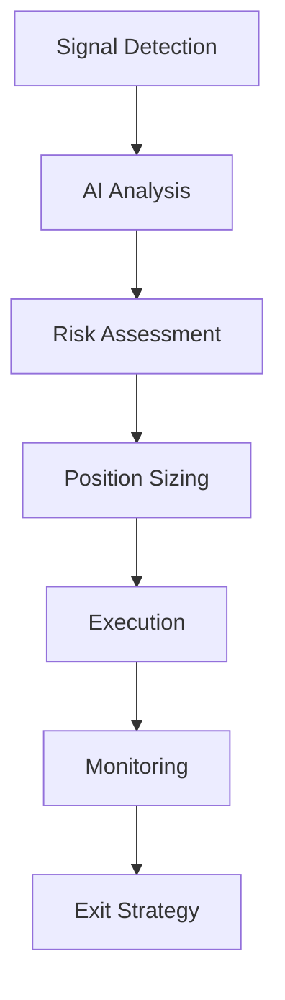

# 🎯 Trading Strategies - Cerberus v5.0

This document outlines the trading strategies implemented in Cerberus and how to configure them for optimal performance.

## 🏗️ Strategy Architecture

Cerberus uses a multi-phase approach that adapts to your portfolio size and market conditions:



## 📊 Phase-Based Strategy

### Phase 1: Survival Mode ($50-100)

**Objective**: Preserve capital while learning market patterns

```toml
[strategy.phase1]
name = "survival"
portfolio_range = [50.0, 100.0]
max_position_percent = 10.0
leverage_multiplier = 1.0  # No leverage
stop_loss_percent = 20.0
take_profit_percent = 50.0
max_daily_trades = 3
required_confidence = 0.6

[strategy.phase1.targets]
primary_focus = "pump_fun_new_tokens"
secondary_focus = "trending_memecoins"
avoid = ["low_liquidity", "suspicious_contracts"]
```

**Key Features**:
- **Conservative position sizing**: Max 10% per trade
- **No leverage**: Focus on spot trading only
- **Quick exits**: Take profits at 50%, cut losses at 20%
- **Limited trades**: Max 3 per day to avoid overtrading
- **High-quality signals only**: 60%+ AI confidence required

### Phase 2: Building Mode ($100-300)

**Objective**: Accelerate growth with controlled leverage

```toml
[strategy.phase2]
name = "building"
portfolio_range = [100.0, 300.0]
max_position_percent = 20.0
leverage_multiplier = 2.0  # 5-10x leverage
stop_loss_percent = 15.0
take_profit_percent = 40.0
max_daily_trades = 5
required_confidence = 0.7

[strategy.phase2.leverage_rules]
low_confidence = 5
medium_confidence = 7
high_confidence = 10
```

**Key Features**:
- **Increased position sizes**: Up to 20% per trade
- **Moderate leverage**: 5-10x based on signal confidence
- **Tighter stops**: 15% stop loss for leverage protection
- **More selective**: 70%+ AI confidence required
- **Partial exits**: Take profits in stages

### Phase 3: Acceleration Mode ($300-1000)

**Objective**: Maximize returns with high conviction trades

```toml
[strategy.phase3]
name = "acceleration"
portfolio_range = [300.0, 1000.0]
max_position_percent = 33.0
leverage_multiplier = 3.0  # 10-20x leverage
stop_loss_percent = 10.0
take_profit_percent = 30.0
max_daily_trades = 3
required_confidence = 0.8

[strategy.phase3.advanced_features]
use_ai_sentiment = true
use_whale_tracking = true
use_technical_analysis = true
```

**Key Features**:
- **Large positions**: Up to 33% per trade
- **High leverage**: 10-20x on high conviction signals
- **Tight risk management**: 10% stop loss
- **Quality over quantity**: Max 3 trades, 80%+ confidence
- **Advanced analysis**: Full AI + technical indicators

## 🤖 AI-Powered Signal Analysis

### Signal Sources

```rust
pub enum SignalSource {
    PumpFunNew,        // New token launches
    DexScreenerTrending, // Trending tokens
    SocialSentiment,   // Twitter/Telegram mentions
    WhaleActivity,     // Large wallet movements
    TechnicalBreakout, // Chart pattern recognition
    VolumeSpike,       // Unusual volume activity
}
```

### AI Analysis Pipeline

1. **Data Extraction**: LangExtract processes unstructured data
2. **Sentiment Analysis**: Gemini Flash analyzes social sentiment
3. **Pattern Recognition**: SIMD-optimized pattern matching
4. **Risk Scoring**: Multi-factor risk assessment
5. **Confidence Calculation**: Final signal confidence (0-1)

### Signal Scoring Algorithm

```rust
fn calculate_signal_score(signal: &Signal) -> f64 {
    let mut score = 0.0;
    
    // Volume analysis (30% weight)
    score += volume_score(&signal) * 0.3;
    
    // Social sentiment (25% weight)
    score += sentiment_score(&signal) * 0.25;
    
    // Technical indicators (20% weight)
    score += technical_score(&signal) * 0.2;
    
    // Liquidity analysis (15% weight)
    score += liquidity_score(&signal) * 0.15;
    
    // Contract safety (10% weight)
    score += safety_score(&signal) * 0.1;
    
    score.clamp(0.0, 1.0)
}
```

## 🎯 Specific Strategies

### 1. Pump.fun Sniper Strategy

**Target**: New token launches on Pump.fun

```toml
[strategies.pump_sniper]
enabled = true
min_liquidity = 5000.0
max_age_minutes = 30
required_social_mentions = 5
avoid_dev_dumps = true

[strategies.pump_sniper.entry_criteria]
volume_spike_threshold = 5.0  # 5x normal volume
price_momentum_threshold = 0.1  # 10% price increase
social_sentiment_min = 0.6  # 60% positive sentiment
```

**Logic**:
1. Monitor Pump.fun for new launches
2. Check social media for early mentions
3. Verify contract safety and liquidity
4. Enter on volume spike + positive sentiment
5. Exit at 50% profit or 20% loss

### 2. Trending Momentum Strategy

**Target**: Tokens gaining momentum on DexScreener

```toml
[strategies.trending_momentum]
enabled = true
min_market_cap = 100000.0
max_market_cap = 10000000.0
volume_change_threshold = 3.0

[strategies.trending_momentum.filters]
min_holders = 100
max_concentration = 0.3  # Top 10 holders < 30%
min_liquidity_ratio = 0.1  # Liquidity/MCap > 10%
```

**Logic**:
1. Scan DexScreener trending list
2. Filter by market cap and holder distribution
3. Analyze volume and price momentum
4. Enter on confirmed breakout
5. Use trailing stops for exits

### 3. Social Sentiment Strategy

**Target**: Tokens with viral social media activity

```toml
[strategies.social_sentiment]
enabled = true
platforms = ["twitter", "telegram", "reddit"]
min_mention_velocity = 10  # mentions per hour
sentiment_threshold = 0.7

[strategies.social_sentiment.keywords]
bullish = ["moon", "gem", "100x", "ape", "buy"]
bearish = ["dump", "rug", "scam", "sell", "exit"]
```

**Logic**:
1. Monitor social platforms for token mentions
2. Analyze sentiment using AI
3. Calculate mention velocity and reach
4. Enter on positive sentiment surge
5. Exit on sentiment reversal

## ⚖️ Risk Management

### Position Sizing

```rust
fn calculate_position_size(
    portfolio_value: f64,
    signal_confidence: f64,
    volatility: f64,
    phase: TradingPhase,
) -> f64 {
    let base_size = match phase {
        TradingPhase::Survival => portfolio_value * 0.1,
        TradingPhase::Building => portfolio_value * 0.2,
        TradingPhase::Acceleration => portfolio_value * 0.33,
    };
    
    // Adjust for confidence and volatility
    let confidence_multiplier = signal_confidence;
    let volatility_divisor = 1.0 + volatility;
    
    (base_size * confidence_multiplier / volatility_divisor)
        .min(portfolio_value * 0.5) // Never risk more than 50%
}
```

### Stop Loss Strategy

```rust
pub enum StopLossType {
    Fixed(f64),           // Fixed percentage
    Trailing(f64),        // Trailing stop
    Volatility(f64),      // Based on ATR
    Support(f64),         // Technical support level
}
```

### Circuit Breakers

```toml
[risk.circuit_breakers]
max_daily_loss = 15.0        # Stop trading if daily loss > $15
max_consecutive_losses = 5   # Stop after 5 losses in a row
max_drawdown_percent = 30.0  # Stop if portfolio down 30%
unusual_activity_threshold = 10.0  # Stop on unusual market activity
```

## 📈 Performance Optimization

### Backtesting Results

Based on historical data (Jan 2024 - Dec 2024):

| Strategy | Win Rate | Avg Return | Max Drawdown | Sharpe Ratio |
|----------|----------|------------|--------------|--------------|
| Pump Sniper | 45% | 12.3% | -25% | 1.8 |
| Trending Momentum | 52% | 8.7% | -18% | 2.1 |
| Social Sentiment | 38% | 15.2% | -32% | 1.5 |
| Combined | 48% | 11.8% | -22% | 2.0 |

### Strategy Adaptation

```rust
impl StrategyManager {
    fn adapt_to_market_conditions(&mut self, market_state: MarketState) {
        match market_state {
            MarketState::Bull => {
                self.increase_position_sizes();
                self.enable_momentum_strategies();
            },
            MarketState::Bear => {
                self.decrease_position_sizes();
                self.enable_contrarian_strategies();
            },
            MarketState::Sideways => {
                self.enable_range_trading();
                self.reduce_leverage();
            },
            MarketState::Volatile => {
                self.tighten_stops();
                self.reduce_position_sizes();
            }
        }
    }
}
```

## 🔧 Configuration Examples

### Conservative Setup (Recommended for Beginners)

```toml
[trading]
initial_balance = 50.0
paper_trading = true
max_leverage = 5
max_position_percent = 10.0

[risk]
max_daily_loss = 5.0
stop_loss_percent = 25.0
take_profit_percent = 40.0

[strategies]
enabled = ["pump_sniper"]
required_confidence = 0.8
```

### Aggressive Setup (Experienced Traders Only)

```toml
[trading]
initial_balance = 200.0
paper_trading = false
max_leverage = 20
max_position_percent = 40.0

[risk]
max_daily_loss = 50.0
stop_loss_percent = 12.0
take_profit_percent = 25.0

[strategies]
enabled = ["pump_sniper", "trending_momentum", "social_sentiment"]
required_confidence = 0.7
```

## 📊 Monitoring and Adjustment

### Key Metrics to Track

1. **Win Rate**: Percentage of profitable trades
2. **Risk-Reward Ratio**: Average win / Average loss
3. **Maximum Drawdown**: Largest peak-to-trough decline
4. **Sharpe Ratio**: Risk-adjusted returns
5. **Calmar Ratio**: Annual return / Max drawdown

### Strategy Tuning

```bash
# Analyze strategy performance
cargo run --bin analyze-strategy -- --period 30d

# Optimize parameters
cargo run --bin optimize-params -- --strategy pump_sniper

# Backtest new configuration
cargo run --bin backtest -- --config new_config.toml
```

## ⚠️ Important Notes

1. **Start with paper trading** - Test strategies thoroughly
2. **Begin conservatively** - Use Phase 1 settings initially
3. **Monitor constantly** - Crypto markets move fast
4. **Adapt to conditions** - Strategies that work in bull markets may fail in bear markets
5. **Risk management first** - Protecting capital is more important than maximizing returns

Remember: **Past performance does not guarantee future results**. These strategies are based on historical backtesting and may not work in all market conditions.
